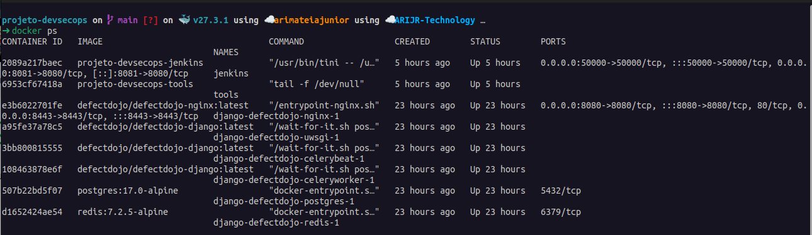

# Projeto DevSecOps - UNIFOR
**Disciplina**: Engenharia de Software com enfâse em DevOps

## Equipe:

- Arimatéia Júnior
- Karime Linhares
- Victor Elpídio

## Descrição
Este projeto foi desenvolvido como trabalho final da disciplina **DevSecOps** na Universidade de Fortaleza (**UNIFOR**) sob a orientação do professor **Cristiano Santos**. O objetivo é criar um pipeline no Jenkins utilizando ferramentas de análise SAST e SCA (Semgrep, Bandit, Trivy e Gitleaks) para identificar vulnerabilidades em um código e enviar os resultados para o **DefectDojo**, que atua como ferramenta de gerenciamento dessas vulnerabilidades.

---

## Estrutura do Projeto
A estrutura do projeto é a seguinte:


```bash
PROJETO-DEVSECOPS/
├── django-DefectDojo/       # Repositório clonado do DefectDojo
├── VAmPI/                   # Repositório clonado para testes (opcional)
├── config.xml               # Configuração do pipeline no Jenkins
├── docker-compose.yml       # Orquestração dos contêineres
├── Dockerfile.jenkins       # Configuração do contêiner Jenkins
├── Dockerfile.tools         # Configuração do contêiner com as ferramentas
└── Jenkinsfile              # Pipeline do Jenkins
```


### Detalhes:
- **django-DefectDojo**: Código-fonte do DefectDojo clonado do [repositório oficial](https://github.com/DefectDojo/django-DefectDojo). Gerencia os relatórios gerados pelas ferramentas.
- **VAmPI**: Aplicação vulnerável usada para testar as ferramentas de análise, clonada do [repositório oficial](https://github.com/erev0s/VAmPI.git). 
- **config.xml**: Configura automaticamente o pipeline no Jenkins.
- **docker-compose.yml**: Define os serviços Docker necessários, incluindo Jenkins, DefectDojo e o contêiner de ferramentas.
- **Dockerfile.jenkins**: Configura o contêiner Jenkins.
- **Dockerfile.tools**: Configura o contêiner com as ferramentas Semgrep, Bandit, Trivy e Gitleaks.
- **Jenkinsfile**: Define as etapas do pipeline no Jenkins.

---

## Pré-requisitos

Antes de iniciar o projeto, certifique-se de ter o seguinte:
1. **Docker e Docker Compose** instalados na sua máquina.
2. Acesso ao **DefectDojo** configurado para receber os relatórios das ferramentas.

---

## Configuração do Ambiente

### 1. Configurando o DefectDojo
Clone o repositório oficial do DefectDojo e configure-o:
```bash
# Clone o projeto
git clone https://github.com/DefectDojo/django-DefectDojo
cd django-DefectDojo

# Construa as imagens Docker
./dc-build.sh

# Suba o ambiente (usando PostgreSQL e Redis)
./dc-up-d.sh postgres-redis

# Obtenha as credenciais do administrador
docker compose logs initializer | grep "Admin password:"
```

Após a configuração, o DefectDojo estará disponível em: (http://localhost:8080)

### 2. Criando Docker-compose.yml e definido os serviços

```bash
version: '3.8'

services:
  jenkins:
    build:
      context: .
      dockerfile: Dockerfile.jenkins
    container_name: jenkins
    user: root
    ports:
      - "8081:8080"
      - "50000:50000"
    volumes:
      - jenkins_home:/var/jenkins_home
      - /var/run/docker.sock:/var/run/docker.sock
      - workspace_data:/var/jenkins_home/workspace # Volume compartilhado para o workspace
    restart: always
    networks:
      - security-network
    depends_on:
      - tools

  tools:
    build:
      context: .
      dockerfile: Dockerfile.tools
    container_name: tools
    volumes:
      - tools_data:/tools
      - workspace_data:/var/jenkins_home/workspace # Monta o mesmo volume do workspace
    networks:
      - security-network

volumes:
  jenkins_home:
    driver: local
  tools_data:
    driver: local
  workspace_data: # Volume para compartilhar o workspace
    driver: local

networks:
  security-network:
    driver: bridge
```

## 3. Criando os Dockerfile do Jenkins e do Tools

### Dockerfile.tools
Este arquivo configura um ambiente contendo as ferramentas Semgrep, Bandit, Trivy e Gitleaks.

```bash
FROM ubuntu:latest

# Atualizar o sistema e instalar dependências
RUN apt update && apt install -y \
    python3 python3-pip python3-venv wget curl git \
    && rm -rf /var/lib/apt/lists/*

# Criar ambiente virtual e instalar Semgrep e Bandit
RUN python3 -m venv /opt/venv \
    && /opt/venv/bin/pip install --upgrade pip \
    && /opt/venv/bin/pip install semgrep bandit

# Instalar Trivy
RUN wget -O trivy.deb $(wget -qO- https://api.github.com/repos/aquasecurity/trivy/releases/latest | grep browser_download_url | grep Linux-64bit.deb | cut -d '"' -f 4) \
    && dpkg -i trivy.deb \
    && rm trivy.deb

# Instalar Gitleaks
RUN wget https://github.com/zricethezav/gitleaks/releases/download/v8.17.0/gitleaks_8.17.0_linux_x64.tar.gz \
    && tar -xzf gitleaks_8.17.0_linux_x64.tar.gz \
    && mv gitleaks /usr/local/bin/gitleaks \
    && chmod +x /usr/local/bin/gitleaks

# Configurar PATH
ENV PATH="/opt/venv/bin:$PATH"

# Diretório de trabalho
WORKDIR /tools

# Comando padrão
CMD ["tail", "-f", "/dev/null"]
```

### Dockerfile.jenkins
Este arquivo configura o ambiente com docker e docker compose para rodar os serviços das ferramentas Semgrep, Bandit, Trivy e Gitleaks em containers.

```bash
FROM jenkins/jenkins:lts

# Mudar para o usuário root para instalar dependências
USER root

# Atualizar pacotes e instalar dependências necessárias
RUN apt-get update && apt-get install -y \
    curl \
    ca-certificates \
    gnupg \
    lsb-release \
    && rm -rf /var/lib/apt/lists/*

# Instalar o Docker
RUN curl -fsSL https://download.docker.com/linux/$(lsb_release -is | tr '[:upper:]' '[:lower:]')/gpg | gpg --dearmor -o /usr/share/keyrings/docker-archive-keyring.gpg && \
    echo "deb [arch=$(dpkg --print-architecture) signed-by=/usr/share/keyrings/docker-archive-keyring.gpg] https://download.docker.com/linux/$(lsb_release -is | tr '[:upper:]' '[:lower:]') $(lsb_release -cs) stable" > /etc/apt/sources.list.d/docker.list && \
    apt-get update && apt-get install -y docker-ce docker-ce-cli containerd.io && \
    rm -rf /var/lib/apt/lists/*

# Instalar Docker Compose
RUN curl -L "https://github.com/docker/compose/releases/latest/download/docker-compose-$(uname -s)-$(uname -m)" -o /usr/local/bin/docker-compose && \
    chmod +x /usr/local/bin/docker-compose

# Garantir que o usuário 'jenkins' está no grupo 'docker'
RUN usermod -aG docker jenkins || true

# Retornar ao usuário Jenkins (opcional, mas recomendado)
USER jenkins
```

## 4. Configurando os Serviços (Jenkins e Ferramentas tools)
No diretório do projeto, crie os serviços definidos no docker-compose.yml:

### Construa e Suba os serviços
```bash
docker-compose build && docker compose up -d
```
Este comando criará dois contêineres:

### 1.Jenkins: Serviço principal para execução do pipeline.
### 2.Tools: Contêiner com as ferramentas (Semgrep, Bandit, Trivy e Gitleaks).

# Containers



## 5. Pipeline

Pipeline do Jenkins
O pipeline, configurado no arquivo Jenkinsfile, executa as etapas descritas abaixo:


```bash
pipeline {
    agent any
    environment {
        DEFECTDOJO_URL = "insira a url do seu ambiente" // URL do DefectDojo
        DEFECTDOJO_TOKEN = "insira o token gerado no defectdojo" // Token do DefectDojo
        ENGAGEMENT_ID = "Insira o ID do engajamento" // ID do engajamento
    }
    stages {
        stage('Configurar Diretório como Seguro no Git') {
            steps {
                sh '''
                echo "Configurando diretório como seguro para o Git..."
                git config --global --add safe.directory /var/jenkins_home/workspace/Pipeline_VAmPI
                '''
            }
        }
        stage('Clone ou Atualizar Repositório') {
            steps {
                sh '''
                if [ -d "/var/jenkins_home/workspace/Pipeline_VAmPI/.git" ]; then
                    echo "Repositório já existe. Atualizando..."
                    cd /var/jenkins_home/workspace/Pipeline_VAmPI
                    git reset --hard
                    git clean -fd
                    git pull origin master
                else
                    echo "Clonando o repositório..."
                    git clone https://github.com/erev0s/VAmPI.git /var/jenkins_home/workspace/Pipeline_VAmPI
                fi
                '''
            }
        }
        stage('Análise SAST - Semgrep') {
            steps {
                script {
                    sh '''
                    echo "Executando análise com Semgrep..."
                    docker exec tools semgrep --config=auto /var/jenkins_home/workspace/Pipeline_VAmPI -o /tools/semgrep.json --json || {
                        echo "Erro ao executar Semgrep.";
                        exit 1;
                    }

                    echo "Validando se o relatório Semgrep foi gerado..."
                    if ! docker exec tools test -s /tools/semgrep.json; then
                        echo "Erro: Relatório Semgrep não foi gerado ou está vazio.";
                        exit 1;
                    fi

                    echo "Enviando relatório Semgrep para DefectDojo..."
                    docker exec tools curl -X POST -H "Authorization: Token ${DEFECTDOJO_TOKEN}" \
                        -F "scan_type=Semgrep JSON Report" \
                        -F "engagement=${ENGAGEMENT_ID}" \
                        -F "file=@/tools/semgrep.json" \
                        -F "verified=false" \
                        -F "active=true" \
                        ${DEFECTDOJO_URL}/api/v2/import-scan/ || {
                        echo "Erro ao enviar relatório Semgrep para DefectDojo.";
                        exit 1;
                    }

                    echo "Relatório Semgrep Enviado com Sucesso!"
                    '''
                }
            }
        }
        stage('Análise SAST - Bandit') {
            steps {
                script {
                    sh '''
                    echo "Executando análise com Bandit..."
                    docker exec tools bandit -r /var/jenkins_home/workspace/Pipeline_VAmPI -o /tools/bandit.json -f json || {
                        echo "Erro ao executar Bandit.";
                    }
        
                    echo "Validando se o relatório Bandit foi gerado..."
                    if ! docker exec tools test -s /tools/bandit.json; then
                        echo "Erro: Relatório Bandit não foi gerado ou está vazio.";
                        exit 1;
                    fi
        
                    echo "Enviando relatório Bandit para DefectDojo..."
                    docker exec tools curl -X POST -H "Authorization: Token ${DEFECTDOJO_TOKEN}" \
                        -F "scan_type=Bandit Scan" \
                        -F "engagement=${ENGAGEMENT_ID}" \
                        -F "file=@/tools/bandit.json" \
                        -F "verified=false" \
                        -F "active=true" \
                        ${DEFECTDOJO_URL}/api/v2/import-scan/ || {
                        echo "Erro ao enviar relatório Bandit para DefectDojo.";
                        exit 1;
                    }
        
                    echo "Relatório Bandit Enviado com Sucesso!"
                    '''
                }
            }
        }

        stage('Análise SCA - Trivy') {
            steps {
                script {
                    sh '''
                    echo "Executando análise com Trivy..."
                    docker exec tools trivy fs /var/jenkins_home/workspace/Pipeline_VAmPI --format json --output /tools/trivy.json || {
                        echo "Erro ao executar Trivy.";
                        exit 1;
                    }

                    echo "Validando se o relatório Trivy foi gerado..."
                    if ! docker exec tools test -s /tools/trivy.json; then
                        echo "Erro: Relatório Trivy não foi gerado ou está vazio.";
                        exit 1;
                    fi

                    echo "Enviando relatório Trivy para DefectDojo..."
                    docker exec tools curl -X POST -H "Authorization: Token ${DEFECTDOJO_TOKEN}" \
                        -F "scan_type=Trivy Scan" \
                        -F "engagement=${ENGAGEMENT_ID}" \
                        -F "file=@/tools/trivy.json" \
                        -F "verified=false" \
                        -F "active=true" \
                        ${DEFECTDOJO_URL}/api/v2/import-scan/ || {
                        echo "Erro ao enviar relatório Trivy para DefectDojo.";
                        exit 1;
                    }

                    echo "Relatório Trivy Enviado com Sucesso!"
                    '''
                }
            }
        }
        stage('Análise de Segredos - Gitleaks') {
            steps {
                script {
                    sh '''
                    echo "Executando análise com Gitleaks..."
                    docker exec tools gitleaks detect --source=/var/jenkins_home/workspace/Pipeline_VAmPI --report-format=json --report-path=/tools/gitleaks.json || {
                        echo "Erro ao executar Gitleaks.";
                        exit 1;
                    }

                    echo "Validando se o relatório Gitleaks foi gerado..."
                    if ! docker exec tools test -s /tools/gitleaks.json; then
                        echo "Erro: Relatório Gitleaks não foi gerado ou está vazio.";
                        exit 1;
                    fi

                    echo "Enviando relatório Gitleaks para DefectDojo..."
                    docker exec tools curl -X POST -H "Authorization: Token ${DEFECTDOJO_TOKEN}" \
                        -F "scan_type=Gitleaks Scan" \
                        -F "engagement=${ENGAGEMENT_ID}" \
                        -F "file=@/tools/gitleaks.json" \
                        -F "verified=false" \
                        -F "active=true" \
                        ${DEFECTDOJO_URL}/api/v2/import-scan/ || {
                        echo "Erro ao enviar relatório Gitleaks para DefectDojo.";
                        exit 1;
                    }

                    echo "Relatório Gitleaks Enviado com Sucesso!"
                    '''
                }
            }
        }
    }
    post {
        always {
            echo 'Pipeline finalizado.'
        }
        failure {
            echo 'Pipeline falhou!'
        }
    }
}
```


*Figura 1: Execução do pipeline no Jenkins, incluindo os resultados das ferramentas de análise.*


*Figura 2: Scans gerados dentro do container tools.*


*Figura 3: Tela principal DefectDoJo.*


*Figura 4: Vulnerabilidades exibidas pelo DefectDoJo.*

## 6. Ferramentas Utilizadas

#### 🛡️ Semgrep
O Semgrep é uma ferramenta de análise SAST que verifica códigos em busca de padrões que possam representar vulnerabilidades. Ele utiliza regras customizáveis e suporta diversas linguagens.

- **Execução no Pipeline**: O Semgrep analisa os arquivos do repositório clonado e gera um relatório que é enviado ao DefectDojo.

[🌐 Site oficial do Semgrep](https://semgrep.dev/)

---

#### 🐍 Bandit
O Bandit é uma ferramenta de análise estática voltada para código Python, que verifica por vulnerabilidades comuns.

- **Execução no Pipeline**: O Bandit escaneia o repositório em busca de possíveis problemas de segurança no código e envia o relatório para o DefectDojo.

[🌐 Site oficial do Bandit](https://github.com/PyCQA/bandit)

---

#### 🛠️ Trivy
O Trivy é uma ferramenta de análise SCA que verifica vulnerabilidades em dependências e contêineres.

- **Execução no Pipeline**: O Trivy analisa as dependências do projeto e gera um relatório sobre possíveis vulnerabilidades.

[🌐 Site oficial do Trivy](https://github.com/aquasecurity/trivy)

---

#### 🔑 Gitleaks
O Gitleaks é uma ferramenta de análise para detectar segredos vazados, como chaves de API e senhas, em repositórios Git.

- **Execução no Pipeline**: O Gitleaks escaneia o histórico do repositório e gera um relatório que é enviado ao DefectDojo.

[🌐 Site oficial do Gitleaks](https://github.com/gitleaks/gitleaks)

---

#### 📊 DefectDojo
O DefectDojo é uma ferramenta de gerenciamento de vulnerabilidades que consolida os resultados dos scans em um único painel, permitindo a análise centralizada das vulnerabilidades encontradas.

[🌐 Site oficial do DefectDojo](https://www.defectdojo.org/)

| Ferramenta      | Função                                                                                     | Link                                                                 |
|------------------|--------------------------------------------------------------------------------------------|----------------------------------------------------------------------|
| 🛡️ **Semgrep**  | Ferramenta de análise SAST que verifica códigos em busca de vulnerabilidades.              | [Site Oficial](https://semgrep.dev/)                                |
| 🐍 **Bandit**    | Análise estática voltada para código Python, verificando vulnerabilidades comuns.          | [Site Oficial](https://github.com/PyCQA/bandit)                     |
| 🛠️ **Trivy**    | Ferramenta de análise SCA que verifica vulnerabilidades em dependências e contêineres.     | [Site Oficial](https://github.com/aquasecurity/trivy)               |
| 🔑 **Gitleaks**  | Detecta segredos vazados (chaves de API, senhas) em repositórios Git.                      | [Site Oficial](https://github.com/gitleaks/gitleaks)                |
| 📊 **DefectDojo**| Consolida resultados de scans em um painel de gerenciamento de vulnerabilidades.           | [Site Oficial](https://www.defectdojo.org/)                         |


## 7. Conclusão

Este projeto demonstra como integrar ferramentas modernas de segurança em um pipeline DevSecOps. Ao utilizar ferramentas como Semgrep, Bandit, Trivy e Gitleaks junto ao DefectDojo, conseguimos identificar, gerenciar e mitigar vulnerabilidades de forma centralizada e eficiente.